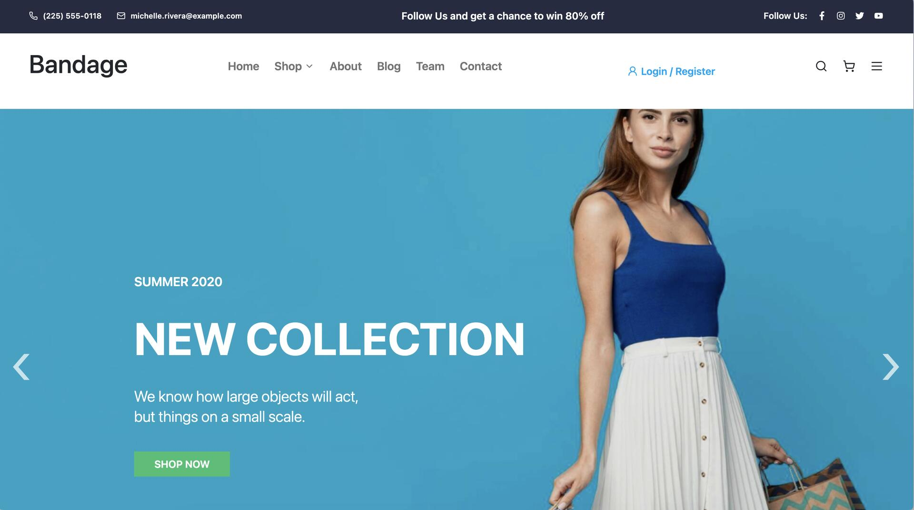
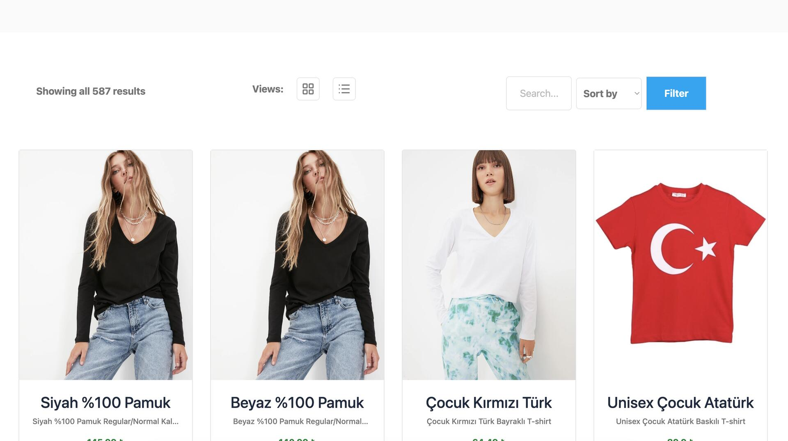
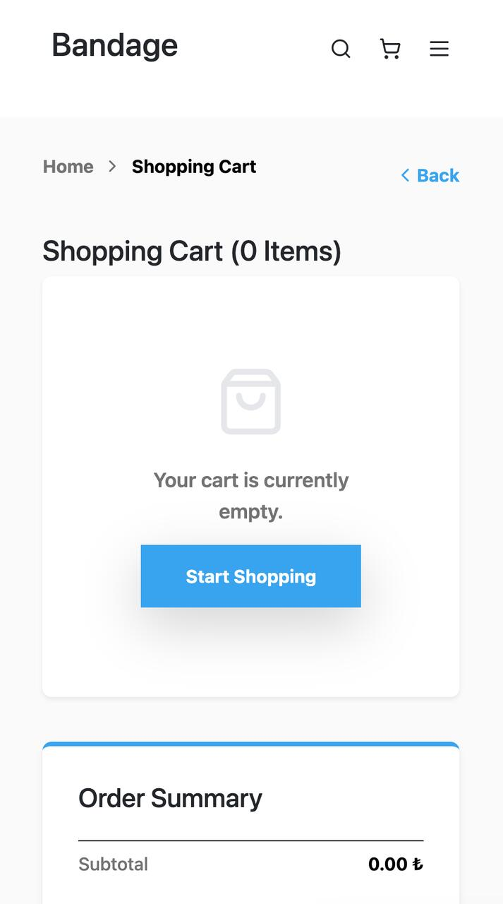
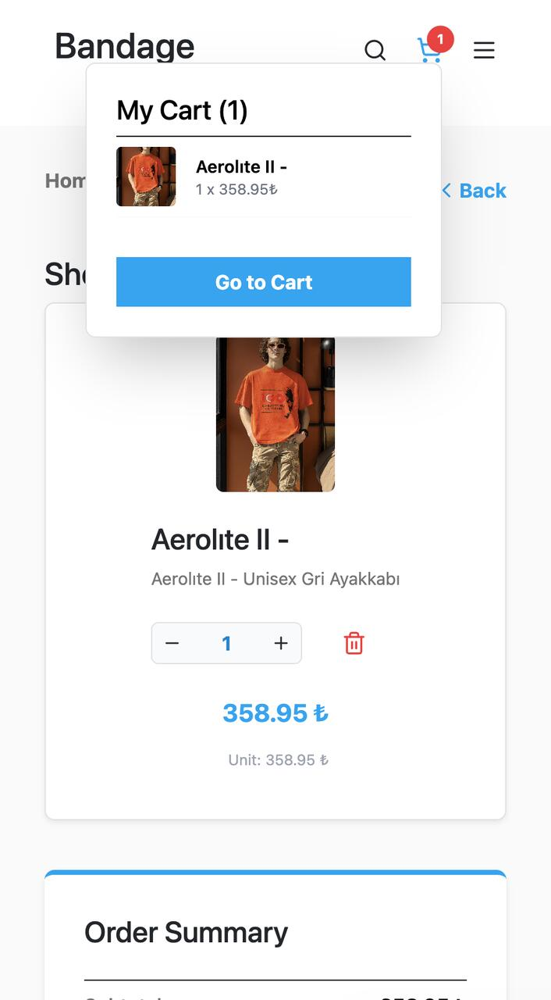

# 🛍️ E-Commerce Web Application Frontend

A fast, responsive, and feature-rich e-commerce web application built with **React**, **Vite**, **Redux**, and **Tailwind CSS**. Designed to work seamlessly with a RESTful backend service for dynamic shopping experiences.

## ✨ Features

- **Optimized Build & Performance:** Powered by **Vite** for lightning-fast development and optimized production builds.
- **Global State Management:** Centralized **Redux** store managing shopping cart operations, category state, and user session handling with token-based auto-login.
- **Dynamic Product Browsing:** Product listing, category filtering, and search functionality using URL query parameters for shareable links.
- **Authentication & User Session:** End-to-end authentication flow including Sign Up, Login, and persistent JWT-based session management.
- **Multi-page Architecture:** Modular routing with Product Details, Shopping Cart, Checkout, and Address/Card management.

## 🛠️ Tech Stack

- **Framework:** React.js, Vite
- **State Management:** Redux, Redux Toolkit
- **HTTP Client:** Axios
- **Styling:** Tailwind CSS
- **Routing:** React Router DOM

## 📸 Ekran Görüntüleri / Screenshots

  
  

  
  

## ⚙️ Getting Started

### Prerequisites

Make sure you have Node.js installed on your machine.

### Installation

1. Clone the repository:
   git clone https://github.com/ggozdekocer/e-commerce-project.git
   cd e-commerce-project

2. Install dependencies:
   npm install

3. Run the development server:
   npm run dev

4. Build for production:
   npm run build

## 👤 Author

- **Gözde Koçer** - [LinkedIn](https://linkedin.com/in/gozdekocer) • [GitHub](https://github.com/ggozdekocer)
